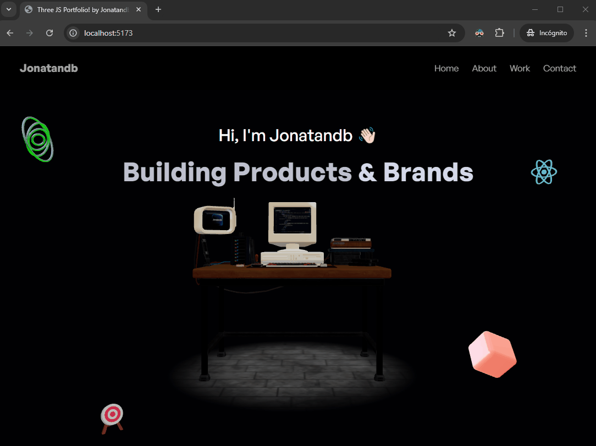

# React + Vite + ThreeJS - 3D Portfolio


## Tech Stack

 - React, Vite, TailwindCSS, ThreeJS, GSAP

---

## Preview

[](https://jonatandb.dev.ar/threejs_portfolio/)


## Online version
[https://jonatandb.dev.ar/threejs_portfolio/](https://jonatandb.dev.ar/threejs_portfolio/)

---
## Run Locally

Clone the project

```bash
  git clone https://github.com/Jonatandb/threejs_portfolio
```

Go to the project directory

```bash
  cd threejs_portfolio
```

Install dependencies

```bash
  pnpm install
```
  - You can also use npm or yarn. But stay consistent to avoid problems.

Start the server

```bash
  pnpm run dev
```

Visit:
- http://localhost:5173


---
## Production build for Github Pages

Build the project:

```bash
  pnpm build
```

Update paths to resources to include project name:

  - Open "docs\assets\index-[hashed part].js"
  - Search for and replace this paths:
    - "/assets/" -> "/threejs_portfolio/assets/"
    - "/models/" -> "/threejs_portfolio/models/"
    - "/textures/" -> "/threejs_portfolio/textures/"

---

## Useful websites
- [Three.js](https://threejs.org/) – JavaScript 3D Library.
- [GLTF convertor](https://gltf.pmnd.rs/) – 🎮 Turns GLTFs into JSX components.
- [Sketchfab](https://sketchfab.com/3d-models/hacker-room-stylized-a0cfe6edf2dd494c8a95addf6bb13a10) – 🚗 3D Models.
- [GSAP](https://gsap.com/) – A wildly robust JavaScript animation library built for professionals.
- [React-globe.gl](https://github.com/vasturiano/react-globe.gl) – React component for Globe Data Visualization using ThreeJS/WebGL.
- [EmailJS](https://www.emailjs.com/) – Send email directly from your code – no server side code required.
- [\<model-viewer>](https://modelviewer.dev/) – Easily display interactive 3D models on the web & in AR.
- [glTF Viewer](https://gltf-viewer.donmccurdy.com/)
- [RealFaviconGenerator](https://realfavicongenerator.net/) – Favicon generator. For real.
---


## Author

- Jonatandb - [@jonatandb](https://www.github.com/jonatandb)
